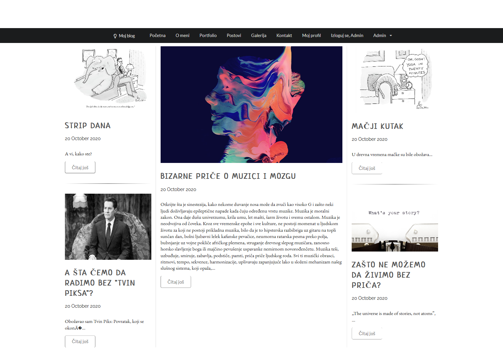

# mojblog

This is an example of a blog website made in php/mysql, styled with semanticUI with working login/register page and admin panel for editing every option.
  
   
.png)   
.png)  
.png)   
.png)   
